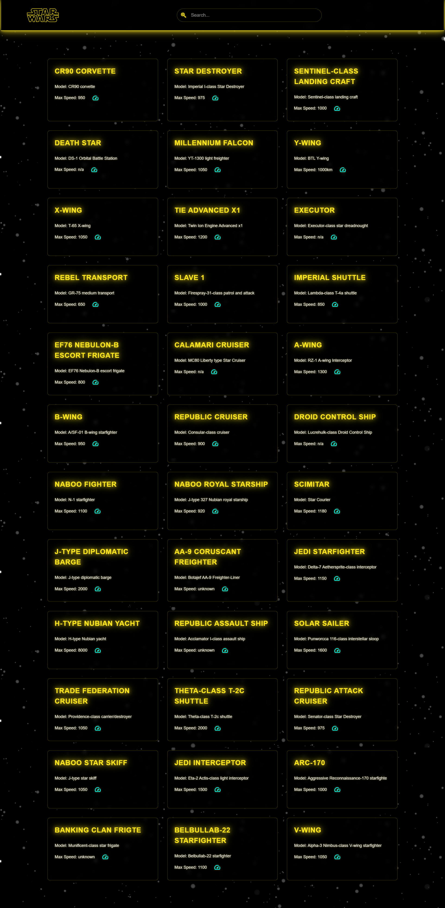
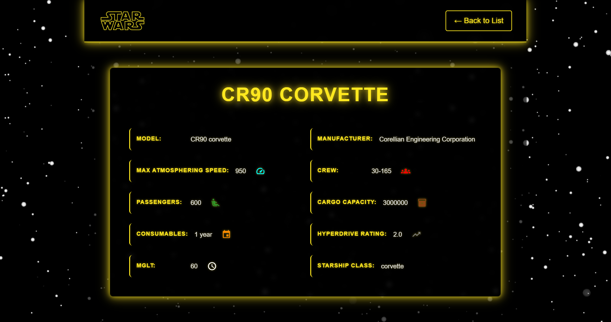
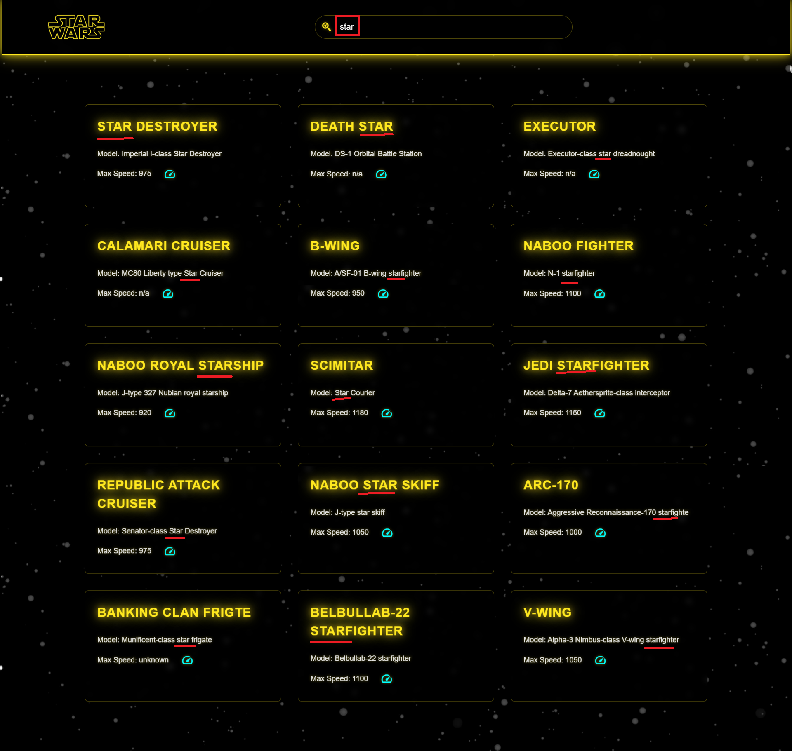

# 🌌 Star Wars API App | React + Vite

[🇬🇧 İngilizce README için tıklayın](./README.md)

*Oluşturulma Tarihi: 5 Mayıs 2025*

Star Wars evrenindeki uzay gemilerini görüntüleyebileceğiniz, modern ve kullanıcı dostu bir web uygulamasıdır. React ve Vite ile geliştirilmiştir.

* Bu proje, Patika Frontend Bootcamp'i için oluşturulan **Hafta-12 - Odev-2 | Star Wars API** projesidir.
* SWAPI (Star Wars API) kullanılarak uzay gemilerinin listelenmesi ve detaylarının görüntülenmesi sağlanmıştır.
* **React**, **Vite**, **CSS3** ve **SWAPI** kullanılmıştır.
* React Hooks ile state yönetimi sağlanmıştır.

---

## 🌐 Canlı Demo

Canlı siteyi ziyaret edin : [Star Wars API](https://star-wars-api-reactjs.vercel.app/)

---

## :computer: Kurulum ve Kullanım

1. Repoyu klonlayın:
```bash
git clone https://github.com/tunahanyasar/star-wars-api-reactjs.git
```

2. Proje klasörüne gidin:
```bash
cd star-wars-api-reactjs
```

3. Bağımlılıkları yükleyin:
```bash
npm install
```

4. Geliştirme sunucusunu başlatın:
```bash
npm run dev
```

Uygulamayı açmak için tarayıcınızda `http://localhost:5173` adresine gidin.

---

## 🗂️ Proje Yapısı

```
star-wars-api-reactjs/
│
├─ src/
│   ├─ components/
│   │   ├─ StarshipList.jsx
│   │   └─ StarshipDetail.jsx
│   ├─ assets/
│   │   └─ screenshots/
│   │       ├─ fullpage.png
│   │       ├─ detailpage.png
│   │       └─ search.png
│   ├─ App.jsx
│   ├─ App.css
│   ├─ index.css
│   ├─ main.jsx
│   └─ apiTest.js
├─ public/
├─ index.html
├─ package.json
└─ ...
```

### Dosya ve Klasör Açıklamaları

- **/src/components/**
  - **StarshipList.jsx:** Uzay gemilerinin listesini yöneten ana bileşen.
  - **StarshipDetail.jsx:** Uzay gemisi detay sayfası bileşeni.
- **/src/assets/screenshots/**: Uygulamanın ekran görüntüleri.
- **App.jsx:** Ana uygulama dosyası.
- **App.css & index.css:** Tüm stil dosyaları.
- **main.jsx:** React uygulamasının giriş noktası.
- **apiTest.js:** SWAPI ile iletişimi sağlayan API fonksiyonları test dosyası.
- **index.html:** Uygulamanın HTML ana dosyası.
- **package.json:** Proje bağımlılıkları ve scriptler.

---

## :star2: Mevcut Özellikler

1. **Uzay Gemisi İşlemleri**
   - Tüm uzay gemilerini listeleme  
     Görsel : [Tüm Gemiler](#fullpage)
   - Uzay gemisi detaylarını görüntüleme  
     Görsel : [Detay Sayfası](#details-page)
   - Tekrar eden gemileri filtreleme
   - Sayfalama ile tüm gemileri yükleme

2. **Arama ve Filtreleme**
   - Gemi adına göre arama
   - Model adına göre arama
   - Büyük/küçük harf duyarsız arama  
     Görsel : [Arama Özelliği](#search)

3. **Modern UI/UX**
   - Kullanıcı dostu arayüz
   - Temiz ve düzenli kod yapısı
   - Yükleme durumu göstergeleri

---

## 💡 Kullanılan Yapılar | Kazanımlar

**React:**
* Component Mimarisi
* Props Sistemi
* React Hooks (useState, useEffect)
* Event Handling
* Conditional Rendering
* React Router

**CSS:**
* Flexbox Layout
* CSS Grid
* Transform & Transitions
* Responsive Design
* Custom Properties

**JavaScript:**
* ES6+ Özellikleri
* Array Metodları
* API Entegrasyonu
* Event Handling
* State Management
* Asenkron Programlama

---

# :paperclip: Sayfa Çıktıları

### Fullpage


### Details Page


### Search 


---

## 🎮 Nasıl Kullanılır?

1. **Ana Sayfa:**
   - Tüm uzay gemilerinin listesini görüntüleyin
   - Arama kutusunu kullanarak gemileri filtreleyin
   - Herhangi bir gemiye tıklayarak detaylarını görüntüleyin

2. **Detay Sayfası:**
   - Seçilen uzay gemisinin tüm özelliklerini görüntüleyin
   - Geri dön butonu ile ana sayfaya dönün

---

## 🔍 Detaylı Açıklama

### Proje Amacı ve Kapsamı

Bu proje, Star Wars evrenindeki uzay gemilerini görüntülemek ve detaylarını incelemek için geliştirilmiş bir web uygulamasıdır. SWAPI kullanılarak gerçek zamanlı veri çekme işlemleri yapılmaktadır.

### Teknik Detaylar

#### StarshipList.jsx - Ana Liste Bileşeni

**StarshipList.jsx** dosyası, uygulamanın ana bileşenidir ve şu önemli işlevleri içerir:

1. **State Yönetimi**: 
   - useState hook'ları ile uzay gemileri ve yükleme durumu yönetilir
   - useEffect hook'u ile API entegrasyonu sağlanır

2. **Veri İşleme**:
   - Tüm sayfalardan veri çekme
   - Tekrar eden gemileri filtreleme
   - Arama ve filtreleme işlemleri

#### Kullanıcı Deneyimi
- **Yükleme Göstergeleri**: Veri yüklenirken kullanıcıya geri bildirim
- **Kolay Navigasyon**: Detay sayfasına hızlı erişim
- **Arama**: Anlık arama ile hızlı filtreleme

---

## 👤 İletişim

[Tunahan Yaşar](https://github.com/tunahanyasar)  
[LinkedIn](https://www.linkedin.com/in/tunahan-yasar/)

---

## 📚 Kaynaklar ve Referanslar

Bu proje, [SWAPI (Star Wars API)](https://swapi.dev/) kullanılarak geliştirilmiştir. API dokümantasyonu ve veri yapısı için SWAPI'nin resmi dokümantasyonu referans alınmıştır.
